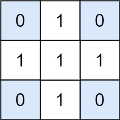

# [1074.Number of Submatrices That Sum to Target][title]

## Description
Given a `matrix` and a `target`, return the number of non-empty submatrices that sum to target.

A submatrix `x1`, `y1`, `x2`, `y2` is the set of all cells `matrix[x][y]` with `x1 <= x <= x2` and `y1 <= y <= y2`.

Two submatrices `(x1, y1, x2, y2)` and `(x1', y1', x2', y2')` are different if they have some coordinate that is different: for example, if `x1 != x1'`.

**Example 1:**  



```
Input: matrix = [[0,1,0],[1,1,1],[0,1,0]], target = 0
Output: 4
Explanation: The four 1x1 submatrices that only contain 0.
```

**Example 2:**

```
Input: matrix = [[1,-1],[-1,1]], target = 0
Output: 5
Explanation: The two 1x2 submatrices, plus the two 2x1 submatrices, plus the 2x2 submatrix.
```

**Example 3:**

```
Input: matrix = [[904]], target = 0
Output: 0
```

## 结语

如果你同我一样热爱数据结构、算法、LeetCode，可以关注我 GitHub 上的 LeetCode 题解：[awesome-golang-algorithm][me]

[title]: https://leetcode.com/problems/number-of-submatrices-that-sum-to-target/
[me]: https://github.com/kylesliu/awesome-golang-algorithm
