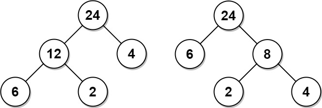
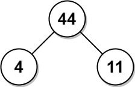

# [1130.Minimum Cost Tree From Leaf Values][title]

## Description
Given an array `arr` of positive integers, consider all binary trees such that:

- Each node has either `0` or `2` children;
- The values of `arr` correspond to the values of each **leaf** in an in-order traversal of the tree.
- The value of each non-leaf node is equal to the product of the largest leaf value in its left and right subtree, respectively.

Among all possible binary trees considered, return the smallest possible sum of the values of each non-leaf node. It is guaranteed this sum fits into a **32-bit** integer.

A node is a **leaf** if and only if it has zero children.

**Example 1:**  



```
Input: arr = [6,2,4]
Output: 32
Explanation: There are two possible trees shown.
The first has a non-leaf node sum 36, and the second has non-leaf node sum 32.
```

**Example 2:**  



```
Input: arr = [4,11]
Output: 44
```

## 结语

如果你同我一样热爱数据结构、算法、LeetCode，可以关注我 GitHub 上的 LeetCode 题解：[awesome-golang-algorithm][me]

[title]: https://leetcode.com/problems/minimum-cost-tree-from-leaf-values/
[me]: https://github.com/kylesliu/awesome-golang-algorithm
