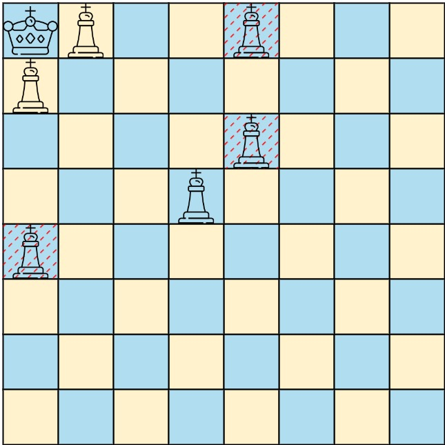

# [1222.Queens That Can Attack the King][title]

## Description
On a **0-indexed** `8 x 8` chessboard, there can be multiple black queens and one white king.

You are given a 2D integer array `queens` where `queens[i] = [xQueeni, yQueeni]` represents the position of the `ith` black queen on the chessboard. You are also given an integer array `king` of length `2` where `king = [xKing, yKing]` represents the position of the white king.

Return the coordinates of the black queens that can directly attack the king. You may return the answer in **any order**.

**Example 1:**  



```
Input: queens = [[0,1],[1,0],[4,0],[0,4],[3,3],[2,4]], king = [0,0]
Output: [[0,1],[1,0],[3,3]]
Explanation: The diagram above shows the three queens that can directly attack the king and the three queens that cannot attack the king (i.e., marked with red dashes).
```

**Example 2:**  


```
Input: queens = [[0,0],[1,1],[2,2],[3,4],[3,5],[4,4],[4,5]], king = [3,3]
Output: [[2,2],[3,4],[4,4]]
Explanation: The diagram above shows the three queens that can directly attack the king and the three queens that cannot attack the king (i.e., marked with red dashes).
```

## 结语

如果你同我一样热爱数据结构、算法、LeetCode，可以关注我 GitHub 上的 LeetCode 题解：[awesome-golang-algorithm][me]

[title]: https://leetcode.com/problems/queens-that-can-attack-the-king/
[me]: https://github.com/kylesliu/awesome-golang-algorithm
