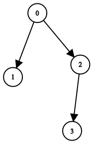
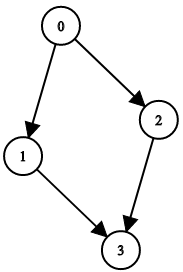

# [1361.Validate Binary Tree Nodes][title]

## Description
You have `n` binary tree nodes numbered from `0` to `n - 1` where node `i` has two children `leftChild[i]` and `rightChild[i]`, return `true` if and only if **all** the given nodes form **exactly one** valid binary tree.

If node `i` has no left child then `leftChild[i]` will equal `-1`, similarly for the right child.

Note that the nodes have no values and that we only use the node numbers in this problem.

**Example 1:**  



```
Input: n = 4, leftChild = [1,-1,3,-1], rightChild = [2,-1,-1,-1]
Output: true
```

**Example 2:**  



```
Input: n = 4, leftChild = [1,-1,3,-1], rightChild = [2,3,-1,-1]
Output: false
```

**Example 3:**  


```
Input: n = 2, leftChild = [1,0], rightChild = [-1,-1]
Output: false
```

## 结语

如果你同我一样热爱数据结构、算法、LeetCode，可以关注我 GitHub 上的 LeetCode 题解：[awesome-golang-algorithm][me]

[title]: https://leetcode.com/problems/validate-binary-tree-nodes/
[me]: https://github.com/kylesliu/awesome-golang-algorithm
