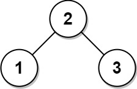

# [1382. Balance a Binary Search Tree][title]

## Description
Given the `root` of a binary search tree, return a **balanced** binary search tree with the same node values. If there is more than one answer, return **any of them**.

A binary search tree is **balanced** if the depth of the two subtrees of every node never differs by more than `1`.
 

**Example 1:**  


```
Input: root = [1,null,2,null,3,null,4,null,null]
Output: [2,1,3,null,null,null,4]
Explanation: This is not the only correct answer, [3,1,4,null,2] is also correct.
```

**Example 2:**  



```
Input: root = [2,1,3]
Output: [2,1,3]
```

## 结语

如果你同我一样热爱数据结构、算法、LeetCode，可以关注我 GitHub 上的 LeetCode 题解：[awesome-golang-algorithm][me]

[title]: https://leetcode.com/problems/balance-a-binary-search-tree
[me]: https://github.com/kylesliu/awesome-golang-algorithm
