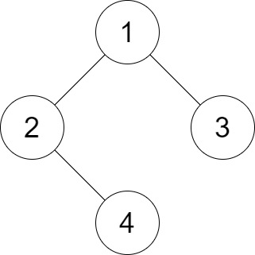

# [1530.Number of Good Leaf Nodes Pairs][title]

## Description
You are given the `root` of a binary tree and an integer `distance`. A pair of two different **leaf** nodes of a binary tree is said to be good if the length of **the shortest path** between them is less than or equal to `distance`.

Return the number of good leaf node pairs in the tree.

**Example 1:**  



```
Input: root = [1,2,3,null,4], distance = 3
Output: 1
Explanation: The leaf nodes of the tree are 3 and 4 and the length of the shortest path between them is 3. This is the only good pair.
```

**Example 2:**  


```
Input: root = [1,2,3,4,5,6,7], distance = 3
Output: 2
Explanation: The good pairs are [4,5] and [6,7] with shortest path = 2. The pair [4,6] is not good because the length of ther shortest path between them is 4.
```

**Example 3:**

```
Input: root = [7,1,4,6,null,5,3,null,null,null,null,null,2], distance = 3
Output: 1
Explanation: The only good pair is [2,5].
```

## 结语

如果你同我一样热爱数据结构、算法、LeetCode，可以关注我 GitHub 上的 LeetCode 题解：[awesome-golang-algorithm][me]

[title]: https://leetcode.com/problems/number-of-good-leaf-nodes-pairs/
[me]: https://github.com/kylesliu/awesome-golang-algorithm
