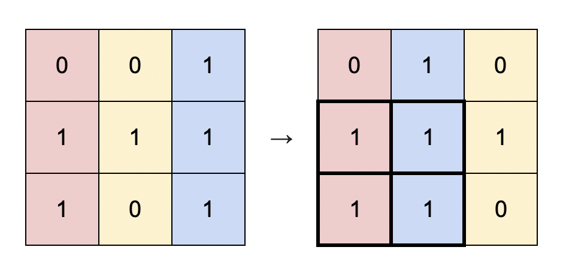

# [1727.Largest Submatrix With Rearrangements][title]

## Description
You are given a binary matrix `matrix` of size `m x n`, and you are allowed to rearrange the **columns** of the `matrix` in any order.

Return the area of the largest submatrix within `matrix` where **every** element of the submatrix is 1 after reordering the columns optimally.

**Example 1:**  



```
Input: matrix = [[0,0,1],[1,1,1],[1,0,1]]
Output: 4
Explanation: You can rearrange the columns as shown above.
The largest submatrix of 1s, in bold, has an area of 4.
```

**Example 2:**  


```
Input: matrix = [[1,0,1,0,1]]
Output: 3
Explanation: You can rearrange the columns as shown above.
The largest submatrix of 1s, in bold, has an area of 3.
```

**Example 3:**

```
Input: matrix = [[1,1,0],[1,0,1]]
Output: 2
Explanation: Notice that you must rearrange entire columns, and there is no way to make a submatrix of 1s larger than an area of 2.
```

## 结语

如果你同我一样热爱数据结构、算法、LeetCode，可以关注我 GitHub 上的 LeetCode 题解：[awesome-golang-algorithm][me]

[title]: https://leetcode.com/problems/largest-submatrix-with-rearrangements/
[me]: https://github.com/kylesliu/awesome-golang-algorithm
