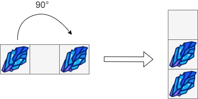
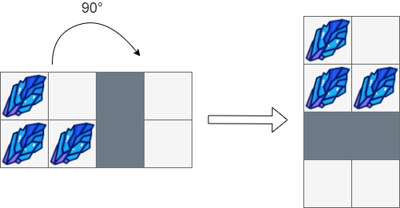
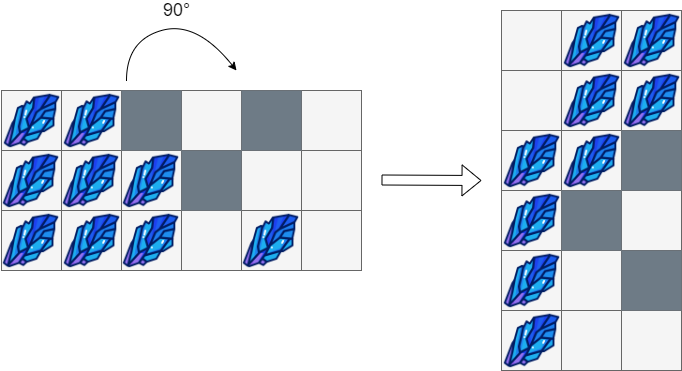

# [1861.Rotating the Box][title]

## Description
You are given an `m x n` matrix of characters `box` representing a side-view of a box. Each cell of the box is one of the following:

- A stone `'#'`
- A stationary obstacle `'*'`
- Empty `'.'`

The box is rotated **90 degrees clockwise**, causing some of the stones to fall due to gravity. Each stone falls down until it lands on an obstacle, another stone, or the bottom of the box. Gravity **does not** affect the obstacles' positions, and the inertia from the box's rotation **does not** affect the stones' horizontal positions.

It is **guaranteed** that each stone in `box` rests on an obstacle, another stone, or the bottom of the box.

Return an `n x m` matrix representing the box after the rotation described above.

**Example 1:**  



```
Input: box = [["#",".","#"]]
Output: [["."],
         ["#"],
         ["#"]]
```

**Example 2:**  



```
Input: box = [["#",".","*","."],
              ["#","#","*","."]]
Output: [["#","."],
         ["#","#"],
         ["*","*"],
         [".","."]]
```

**Example 3:**  



```
Input: box = [["#","#","*",".","*","."],
              ["#","#","#","*",".","."],
              ["#","#","#",".","#","."]]
Output: [[".","#","#"],
         [".","#","#"],
         ["#","#","*"],
         ["#","*","."],
         ["#",".","*"],
         ["#",".","."]]
```

## 结语

如果你同我一样热爱数据结构、算法、LeetCode，可以关注我 GitHub 上的 LeetCode 题解：[awesome-golang-algorithm][me]

[title]: https://leetcode.com/problems/rotating-the-box/
[me]: https://github.com/kylesliu/awesome-golang-algorithm
