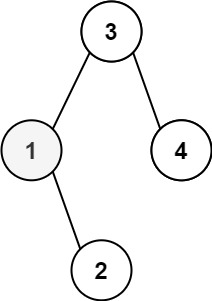

# [230.Kth Smallest Element in a BST][title]

## Description
Given the `root` of a binary search tree, and an integer `k`, return the k<sup>th</sup> smallest value (**1-indexed**) of all the values of the nodes in the tree.


**Example 1:**  



```
Input: root = [3,1,4,null,2], k = 1
Output: 1
```

**Example 2:**  


```
Input: root = [5,3,6,2,4,null,null,1], k = 3
Output: 3
```

## 结语

如果你同我一样热爱数据结构、算法、LeetCode，可以关注我 GitHub 上的 LeetCode 题解：[awesome-golang-algorithm][me]

[title]: https://leetcode.com/problems/kth-smallest-element-in-a-bst/
[me]: https://github.com/kylesliu/awesome-golang-algorithm
