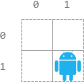

# [2120.Execution of All Suffix Instructions Staying in a Grid][title]

## Description
There is an `n x n` grid, with the top-left cell at (`0, 0`) and the bottom-right cell at (`n - 1, n - 1`). You are given the integer `n` and an integer array `startPos` where `startPos = [startrow, startcol]` indicates that a robot is initially at cell (start<sub>row</sub>, start<sub>col</sub>).

You are also given a **0-indexed** string `s` of length `m` where `s[i]` is the i<sup>th</sup> instruction for the robot: `'L'` (move left), `'R'` (move right), `'U'` (move up), and `'D'` (move down).

The robot can begin executing from any i<sup>th</sup> instruction in `s`. It executes the instructions one by one towards the end of `s` but it stops if either of these conditions is met:

- The next instruction will move the robot off the grid.
- There are no more instructions left to execute.

Return an array `answer` of length `m` where `answer[i]` is the **number of instructions** the robot can execute if the robot **begins executing from** the i<sup>th</sup> instruction in `s`.

**Example 1:**  


```
Input: n = 3, startPos = [0,1], s = "RRDDLU"
Output: [1,5,4,3,1,0]
Explanation: Starting from startPos and beginning execution from the ith instruction:
- 0th: "RRDDLU". Only one instruction "R" can be executed before it moves off the grid.
- 1st:  "RDDLU". All five instructions can be executed while it stays in the grid and ends at (1, 1).
- 2nd:   "DDLU". All four instructions can be executed while it stays in the grid and ends at (1, 0).
- 3rd:    "DLU". All three instructions can be executed while it stays in the grid and ends at (0, 0).
- 4th:     "LU". Only one instruction "L" can be executed before it moves off the grid.
- 5th:      "U". If moving up, it would move off the grid.
```

**Example 2:**  



```
Input: n = 2, startPos = [1,1], s = "LURD"
Output: [4,1,0,0]
Explanation:
- 0th: "LURD".
- 1st:  "URD".
- 2nd:   "RD".
- 3rd:    "D".
```

**Example 3:**  


```
Input: n = 1, startPos = [0,0], s = "LRUD"
Output: [0,0,0,0]
Explanation: No matter which instruction the robot begins execution from, it would move off the grid.
```

## 结语

如果你同我一样热爱数据结构、算法、LeetCode，可以关注我 GitHub 上的 LeetCode 题解：[awesome-golang-algorithm][me]

[title]: https://leetcode.com/problems/execution-of-all-suffix-instructions-staying-in-a-grid/
[me]: https://github.com/kylesliu/awesome-golang-algorithm
