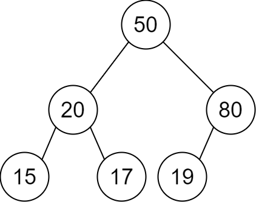

# [2196.Create Binary Tree From Descriptions][title]

## Description
You are given a 2D integer array `descriptions` where `descriptions[i] = [parenti, childi, isLefti]` indicates that `parenti` is the **parent** of `childi` in a **binary** tree of **unique** values. Furthermore,

- If `isLefti == 1`, then `childi` is the left child of `parenti`.
- If `isLefti == 0`, then `childi` is the right child of `parenti`.

Construct the binary tree described by `descriptions` and return its **root**.

The test cases will be generated such that the binary tree is **valid**.

**Example 1:**  



```
Input: descriptions = [[20,15,1],[20,17,0],[50,20,1],[50,80,0],[80,19,1]]
Output: [50,20,80,15,17,19]
Explanation: The root node is the node with value 50 since it has no parent.
The resulting binary tree is shown in the diagram.
```

**Example 2:**  


```
Input: descriptions = [[1,2,1],[2,3,0],[3,4,1]]
Output: [1,2,null,null,3,4]
Explanation: The root node is the node with value 1 since it has no parent.
The resulting binary tree is shown in the diagram.
```

## 结语

如果你同我一样热爱数据结构、算法、LeetCode，可以关注我 GitHub 上的 LeetCode 题解：[awesome-golang-algorithm][me]

[title]: https://leetcode.com/problems/create-binary-tree-from-descriptions/
[me]: https://github.com/kylesliu/awesome-golang-algorithm
