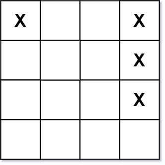

# [419.Battleships in a Board][title]

## Description
Given an `m x n` matrix board where each cell is a battleship `'X'` or empty `'.'`, return the number of the **battleships** on `board`.

**Battleships** can only be placed horizontally or vertically on `board`. In other words, they can only be made of the shape `1 x k` (`1` row, `k` columns) or `k x 1` (`k` rows, `1` column), where `k` can be of any size. At least one horizontal or vertical cell separates between two battleships (i.e., there are no adjacent battleships).

**Example 1:**  



```
Input: board = [["X",".",".","X"],[".",".",".","X"],[".",".",".","X"]]
Output: 2
```

**Example 2:**

```
Input: board = [["."]]
Output: 0
```

## 结语

如果你同我一样热爱数据结构、算法、LeetCode，可以关注我 GitHub 上的 LeetCode 题解：[awesome-golang-algorithm][me]

[title]: https://leetcode.com/problems/battleships-in-a-board/
[me]: https://github.com/kylesliu/awesome-golang-algorithm
