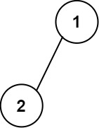
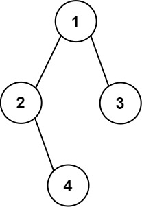

# [655.Print Binary Tree][title]

## Description
Given the `root` of a binary tree, construct a **0-indexed** `m x n` string matrix `res` that represents a **formatted layout** of the tree. The formatted layout matrix should be constructed using the following rules:

- The **height** of the tree is `height` and the number of rows `m` should be equal to `height + 1`.
- The number of columns `n` should be equal to `2^(height+1) - 1`.
- Place the **root node** in the **middle** of the **top row** (more formally, at location `res[0][(n-1)/2]`).
- For each node that has been placed in the matrix at position `res[r][c]`, place its **left child** at `res[r+1][c-2^(height-r-1)]` and its **right child** at `res[r+1][c+2^(height-r-1)]`.
- Continue this process until all the nodes in the tree have been placed.
- Any empty cells should contain the empty string `""`.

Return the constructed matrix `res`.

**Example 1:**  



```
Input: root = [1,2]
Output: 
[["","1",""],
 ["2","",""]]
```

**Example 2:**  



```
Input: root = [1,2,3,null,4]
Output: 
[["","","","1","","",""],
 ["","2","","","","3",""],
 ["","","4","","","",""]]
```

## 结语

如果你同我一样热爱数据结构、算法、LeetCode，可以关注我 GitHub 上的 LeetCode 题解：[awesome-golang-algorithm][me]

[title]: https://leetcode.com/problems/print-binary-tree/
[me]: https://github.com/kylesliu/awesome-golang-algorithm
