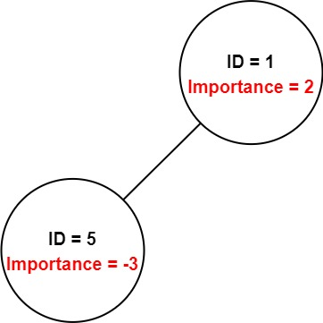

# [690.Employee Importance][title]

## Description
You have a data structure of employee information, including the employee's unique ID, importance value, and direct subordinates' IDs.

You are given an array of employees `employees` where:

- `employees[i].id` is the ID of the i<sup>th</sup> employee.
- `employees[i].importance` is the importance value of the i<sup>th</sup> employee.
- `employees[i].subordinates` is a list of the IDs of the direct subordinates of the i<sup>th</sup> employee.

Given an integer `id` that represents an employee's ID, return the **total** importance value of this employee and all their direct and indirect subordinates.

**Example 1:**  


```
Input: employees = [[1,5,[2,3]],[2,3,[]],[3,3,[]]], id = 1
Output: 11
Explanation: Employee 1 has an importance value of 5 and has two direct subordinates: employee 2 and employee 3.
They both have an importance value of 3.
Thus, the total importance value of employee 1 is 5 + 3 + 3 = 11.
```

**Example 2:**  



```
Input: employees = [[1,2,[5]],[5,-3,[]]], id = 5
Output: -3
Explanation: Employee 5 has an importance value of -3 and has no direct subordinates.
Thus, the total importance value of employee 5 is -3.
```

## 结语

如果你同我一样热爱数据结构、算法、LeetCode，可以关注我 GitHub 上的 LeetCode 题解：[awesome-golang-algorithm][me]

[title]: https://leetcode.com/problems/employee-importance/
[me]: https://github.com/kylesliu/awesome-golang-algorithm
