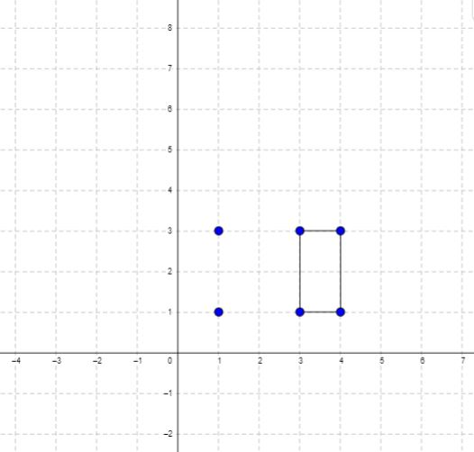

# [939.Minimum Area Rectangle][title]

## Description
You are given an array of points in the **X-Y** plane `points` where `points[i] = [xi, yi]`.

Return the minimum area of a rectangle formed from these points, with sides parallel to the X and Y axes. If there is not any such rectangle, return `0`.

**Example 1:**  


```
Input: points = [[1,1],[1,3],[3,1],[3,3],[2,2]]
Output: 4
```

**Example 2:**  



```
Input: points = [[1,1],[1,3],[3,1],[3,3],[4,1],[4,3]]
Output: 2
```

## 结语

如果你同我一样热爱数据结构、算法、LeetCode，可以关注我 GitHub 上的 LeetCode 题解：[awesome-golang-algorithm][me]

[title]: https://leetcode.com/problems/minimum-area-rectangle/
[me]: https://github.com/kylesliu/awesome-golang-algorithm
