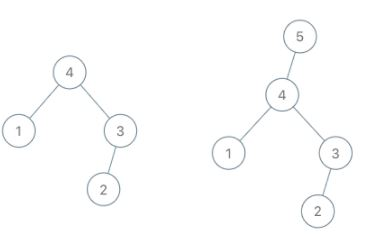
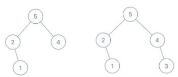
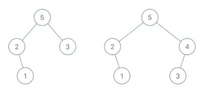

# [998.Maximum Binary Tree II][title]

## Description
A **maximum tree** is a tree where every node has a value greater than any other value in its subtree.

You are given the `root` of a maximum binary tree and an integer `val`.

Just as in the [previous problem](https://leetcode.com/problems/maximum-binary-tree/), the given tree was constructed from a list `a` (`root = Construct(a)`) recursively with the following `Construct(a)` routine:

- If `a` is empty, return `null`.
- Otherwise, let `a[i]` be the largest element of `a`. Create a `root` node with the value `a[i]`.
- The left child of `root` will be `Construct([a[0], a[1], ..., a[i - 1]])`.
- The right child of `root` will be `Construct([a[i + 1], a[i + 2], ..., a[a.length - 1]])`.
- Return `root`.

Note that we were not given `a` directly, only a root node `root = Construct(a)`.

Suppose `b` is a copy of `a` with the value `val` appended to it. It is guaranteed that `b` has unique values.

Return `Construct(b)`.

**Example 1:**  



```
Input: root = [4,1,3,null,null,2], val = 5
Output: [5,4,null,1,3,null,null,2]
Explanation: a = [1,4,2,3], b = [1,4,2,3,5]
```

**Example 2:**  



```
Input: root = [5,2,4,null,1], val = 3
Output: [5,2,4,null,1,null,3]
Explanation: a = [2,1,5,4], b = [2,1,5,4,3]
```

**Example 3:**  



```
Input: root = [5,2,3,null,1], val = 4
Output: [5,2,4,null,1,3]
Explanation: a = [2,1,5,3], b = [2,1,5,3,4]
```

## 结语

如果你同我一样热爱数据结构、算法、LeetCode，可以关注我 GitHub 上的 LeetCode 题解：[awesome-golang-algorithm][me]

[title]: https://leetcode.com/problems/maximum-binary-tree-ii/
[me]: https://github.com/kylesliu/awesome-golang-algorithm
